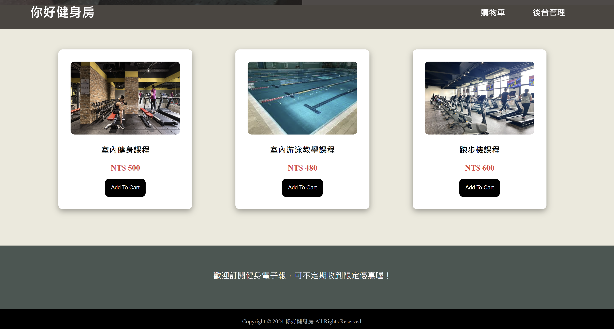
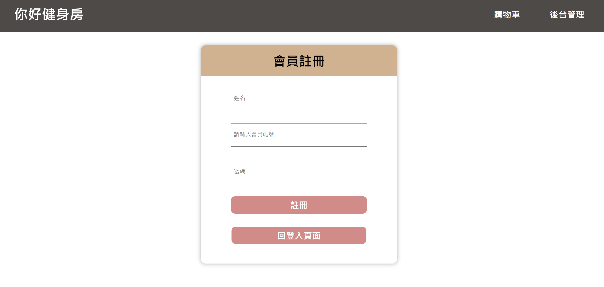
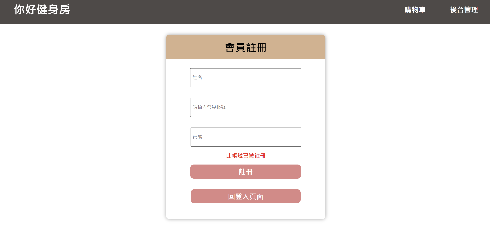

### 前端 : HTML + CSS + Javascript
### 後端 : Node.js + Express.js + MySQL

[Node.js 下載網站連結](https://nodejs.org/en/?source=post_page-----317beefdf182--------------------------------)

### 安裝套件
```
// 在終端機輸入
npm init
npm install express
npm install body-parser
npm install multer
npm install mysql
npm install nodemon
npm install twilio
```

### 啟動專案
```
nodemon server.js
```

### 首頁功能
1. 呈現所有商品資訊，包括商品名稱、圖片、單價
2. 使用者可將商品加入購物車中
3. 點擊上方導覽列的購物車即可查看自己的購物車內容 
4. 頁尾處輸入手機號碼即可收到簡訊的即時優惠通知 
5. 商品被加至購物車後可選擇數量以及移除商品，最後計算出總金額
6. 按下購物車中的結帳按紐進入結帳頁面
7. 點擊上方導覽列的後台管理即可進入網站後台管理商品



### 購物車頁面功能
1. 列出購物車中所有商品
2. 使用者可將商品從購物車中移除
3. 使用者可選擇商品數量
4. 按下買單按鈕進到結帳頁面


### 結帳頁面功能
1. 將使用者的購買清單製成訂單顯示
2. 提交訂單後即會清空購物車並回到首頁
3. 在購物車中數量為0的商品不會被結帳


### 登入頁面功能
1. 使用者登入管理員帳號後即可進入網站後台管理商品項目
2. 若尚未有管理員帳號可選擇註冊管理員帳號按鈕


### 註冊頁面功能
1. 使用者在此頁面註冊管理員帳號
2. 若帳號已註冊過便會在註冊按鈕下方告知提醒以免重複註冊
3. 註冊成功後便會進到登入頁面，註冊失敗則回到此頁面



### 後台管理頁面功能
1. 管理員可在此頁面對每項商品的內容做編輯，包括商品名稱、圖片、單價和商品簡述
2. 編輯後可選擇要保存修改或是取消
3. 管理員可在此頁面上方新增商品項目，也可以將已存在的商品項目刪除，此頁面的所有商品皆會展示在首頁


### 商品頁面功能
1. 使用者在首頁點擊商品就會進到此頁面
2. 顯示商品的名稱、圖片、單價和商品簡述
3. 使用者在選擇商品數量後點擊直接購買按鈕就會進到結帳頁面，沒選擇商品數量則會跳出提醒
4. 使用者也可在此頁面將此商品加入購物車中
5. 加入購物車時若商品已存在購物車中便會跳出提醒


