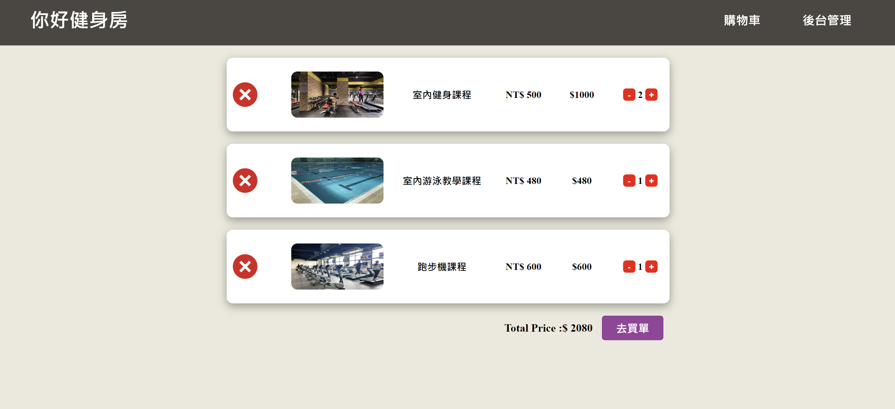
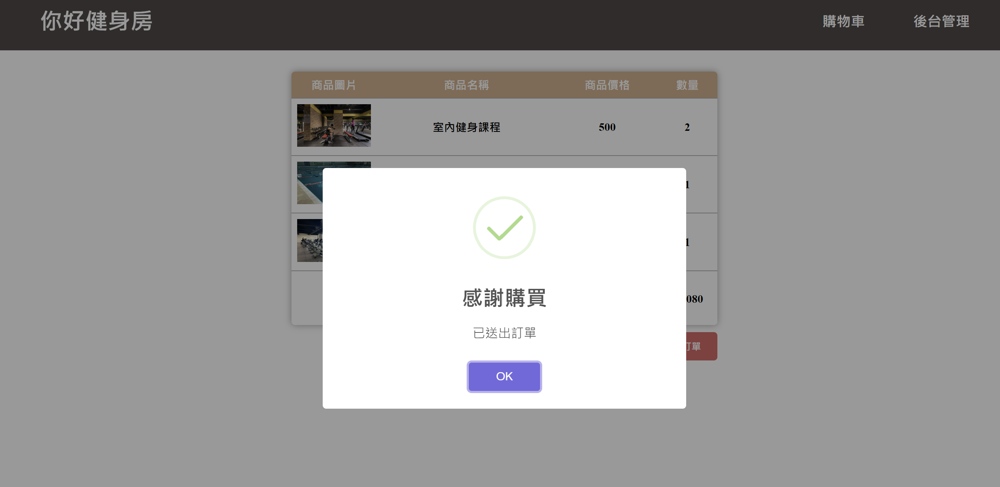

### 前端 : HTML + CSS + Javascript
### 後端 : Node.js + Express.js + MySQL

[Node.js 下載網站連結](https://nodejs.org/en/?source=post_page-----317beefdf182--------------------------------)

### 安裝套件
```
// 在終端機輸入
npm init
npm install express
npm install body-parser
npm install multer
npm install mysql
npm install nodemon
npm install twilio
```

### 啟動專案
```
nodemon server.js
```

### 首頁功能
1. 呈現所有商品資訊，包括商品名稱、圖片、單價和商品簡述
2. 使用者可將欲購買的商品加入購物車 
3. 頁尾處輸入手機號碼即可收到簡訊的即時優惠通知 
4. 商品被加至購物車後可選擇數量以及移除商品，最後計算出總金額
5. 按下購物車中的結帳按紐進入結帳頁面
6. 點擊上方導覽列的後台管理即可進入網站後台管理商品




### 結帳頁面功能
1. 將使用者的購買清單製成訂單顯示
2. 提交訂單後總金額為0時則會提醒使用者選擇商品數量，大於0通知提交訂單成功



### 登入頁面功能
1. 使用者登入管理員帳號後即可進入網站後台管理商品項目
2. 若尚未有管理員帳號可選擇註冊管理員帳號按鈕


### 註冊頁面功能
1. 使用者在此頁面註冊管理員帳號
2. 若帳號已註冊過便會在註冊按鈕下方告知提醒以免重複註冊
3. 註冊成功後便會進到登入頁面，註冊失敗則回到此頁面


### 後台管理頁面功能
1. 管理員可在此頁面對每項商品的內容做編輯，包括商品名稱、圖片、單價和商品簡述
2. 管理員可在此頁面新增商品項目，也可以將已存在的商品項目刪除，此頁面的所有商品皆會展示在首頁
